# 🚀 Data Pipeline End-to-End com Databricks & Delta Lake

> Projeto de engenharia de dados focado em **arquitetura, ingestão incremental, idempotência e camada analítica**, desenvolvido no Databricks utilizando boas práticas de pipelines modernos em cloud.

Este repositório documenta **a construção da arquitetura e do pipeline de dados**, desde a ingestão full load até a configuração da ingestão incremental, garantindo idempotencia e otimização de processamento, além da disponibilização para consumo analítico via dashboards.

---

## 🧭 Visão Geral do Projeto

O objetivo deste projeto foi construir uma **arquitetura de dados em Cloud robusta e moderna**, capaz de:

- Ingerir dados brutos de uma API pública no Bucket S3 em Delta.
- Garantir **idempotência** e **consistência**
- Processar dados em camadas (Bronze, Silver, Gold)
- Suportar cargas **incrementais**
- Disponibilizar dados prontos para análise e visualização de maneira automática e escalável
- Suportar big datas através de processamento distribuído com partições otimizadas

Todo o pipeline foi desenvolvido e executado no **Databricks**, utilizando **Delta Lake** como camada de persistência.

---

## 🏗️ Arquitetura da Solução

<!-- -- imagem do roadmap técnico -- -->

  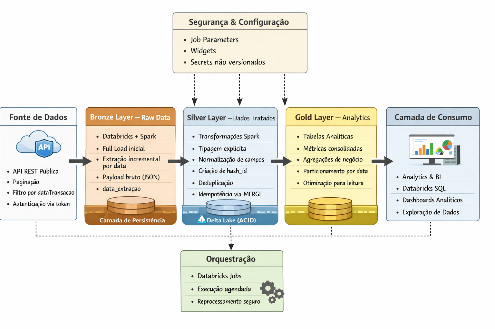

### Componentes principais:
- **Fonte de Dados**: API REST pública: https://api.portaldatransparencia.gov.br/swagger-ui/index.html#/
- **Processamento**: Databricks (Apache Spark)
- **Armazenamento**: Delta Lake
- **Camadas de Dados**:
  - Bronze (Raw)
  - Silver (Dados tratados)
  - Gold (Camada analítica)
- **Consumo**:
  - Databricks SQL
  - Dashboards analíticos

### Pipeline Databricks:

  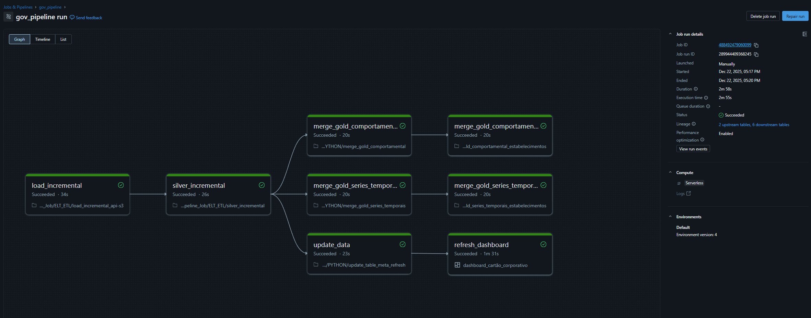

---

## 🧱 Modelagem de Dados (Arquitetura em Camadas)

O pipeline foi estruturado seguindo o padrão **Medallion Architecture**:

### 🥉 Bronze – Raw Data
- Ingestão dos dados **sem transformação**
- Preservação do formato original
- Inclusão de:
  - data de extração
  - payload bruto
- Persistência em Delta Lake

### 🥈 Silver – Dados Tratados
- Tipagem explícita de colunas
- Normalização de campos
- Regras de qualidade
- Criação de **hash de identificação** para controle de duplicidade

### 🥇 Gold – Camada Analítica
- A camada Gold é mantida sincronizada com a Silver por meio de operações MERGE, garantindo atualização automática das métricas agregadas sempre que novos dados são incorporados à camada intermediária.
- Dados agregados e prontos para consumo
- Otimização para dashboards
- Métricas e indicadores de negócio

---

## 🔄 Estratégia de Carga de Dados (Roadmap Técnico)

### 1️⃣ Full Load Inicial
- Criação dos schemas e tabelas Delta
- Primeira carga completa da API
- Garantia de estrutura base para o incremental
- Validação de volume e consistência

> O full load foi necessário para estabelecer o baseline histórico dos dados

---

### 2️⃣ Controle de Idempotência
Para garantir que o pipeline possa ser reexecutado sem gerar duplicidades, foi implementado:

- **Hash de identificação** baseado nos campos relevantes do registro
- Uso de `MERGE INTO` no Delta Lake
- Comparação por hash para detectar novos ou alterados registros

Isso permite:
- Reprocessamento seguro
- Recuperação em caso de falhas
- Consistência dos dados ao longo do tempo

---

### 3️⃣ Carga Incremental
Após o full load, o pipeline passou a operar de forma incremental:

- Leitura da **última data processada**
- Aplicação de janela incremental baseada em `dataTransacao`
- Uso de **overlap controlado** para evitar perda de dados
- Inserção apenas de novos registros

> Essa abordagem reduz custo computacional e tempo de processamento.

---

### 4️⃣ Particionamento e Performance
As tabelas Delta foram otimizadas com:

- Particionamento por data
- Organização voltada para leitura analítica
- Estrutura preparada para escalabilidade

---

## 🔐 Segurança e Gerenciamento de Credenciais

Nenhuma credencial sensível é versionada neste repositório.

O pipeline foi projetado para receber credenciais via:
- **Databricks Job Parameters / Widgets**
- Variáveis de ambiente (execução local)

Essa abordagem garante:
- Segurança
- Portabilidade
- Separação entre código e segredo

---

## 📊 Camada Analítica & Dashboards

### Databricks

  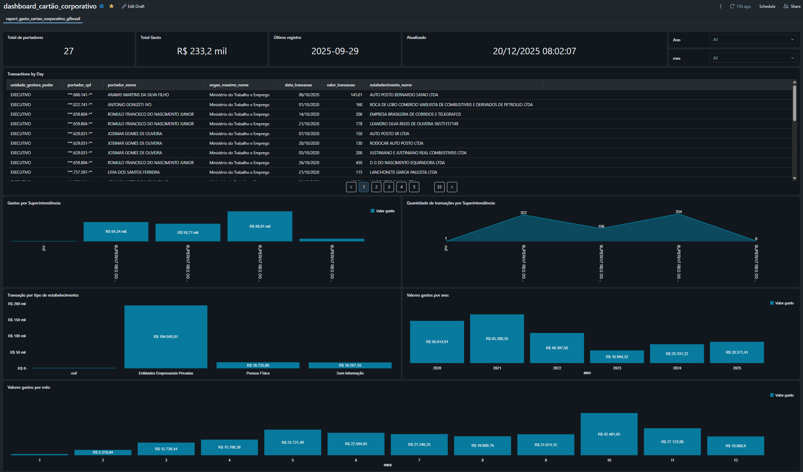

### Power BI

  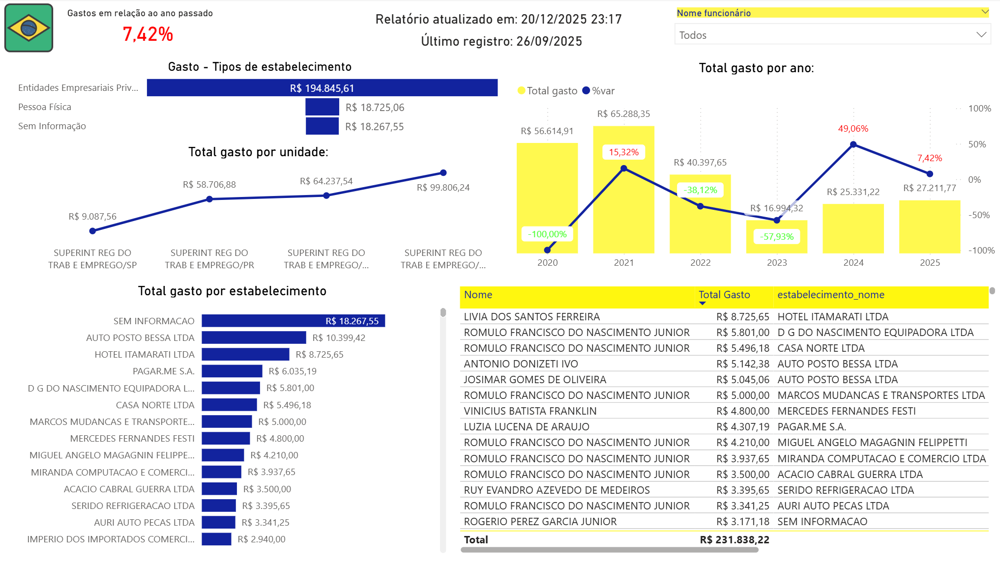

Os dados da camada Gold são consumidos via:
- Databricks SQL
- Power BI
- Dashboards analíticos construídos diretamente sobre tabelas Delta

As queries utilizadas para os dashboards são versionadas e documentadas.

---

## 🛠️ Tecnologias Utilizadas

- Databricks
- Apache Spark
- Delta Lake
- SQL
- Python
- S3 (AWS)
- Git & GitHub

---

## Estrutura do Lakehouse por camadas

🟤 **Bronze**

#### *Payload Original*

  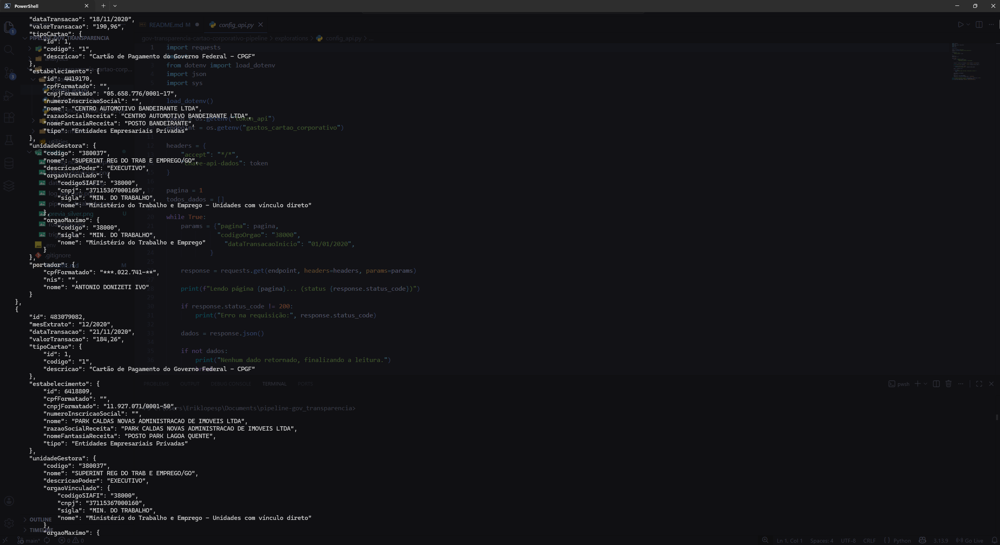

#### Armazenamento em Delta Lake sobre o S3

*Estrutura geral*

  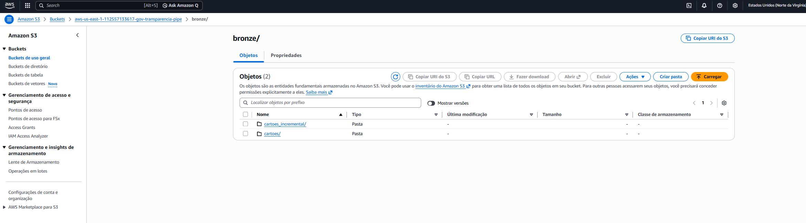

*Full Load*

  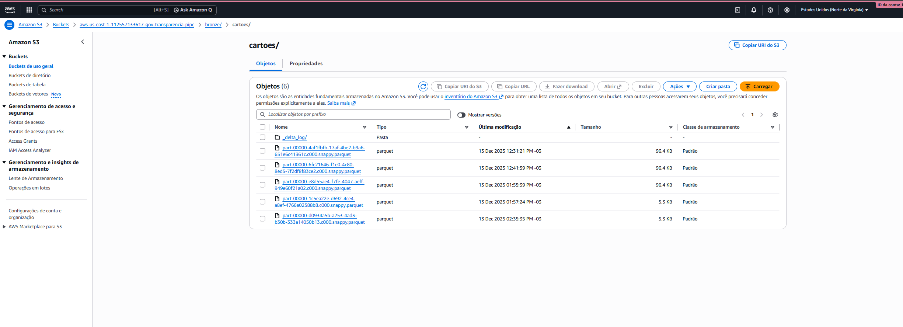

*Incremental*

  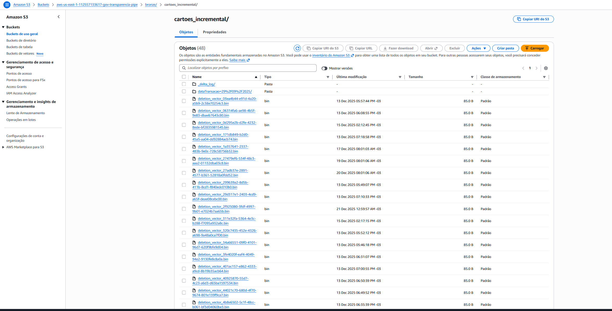

---

⚪ **Silver**

  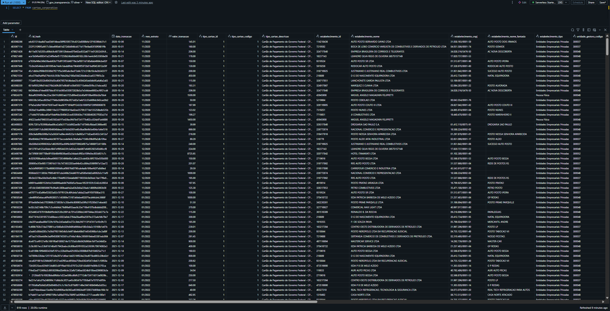

---

🟡 **Gold Portador**

  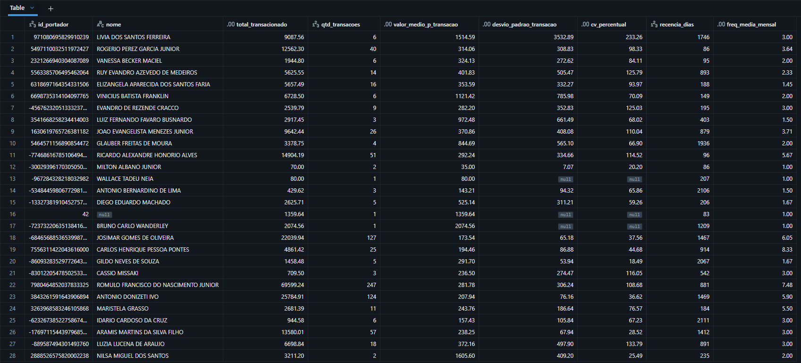

  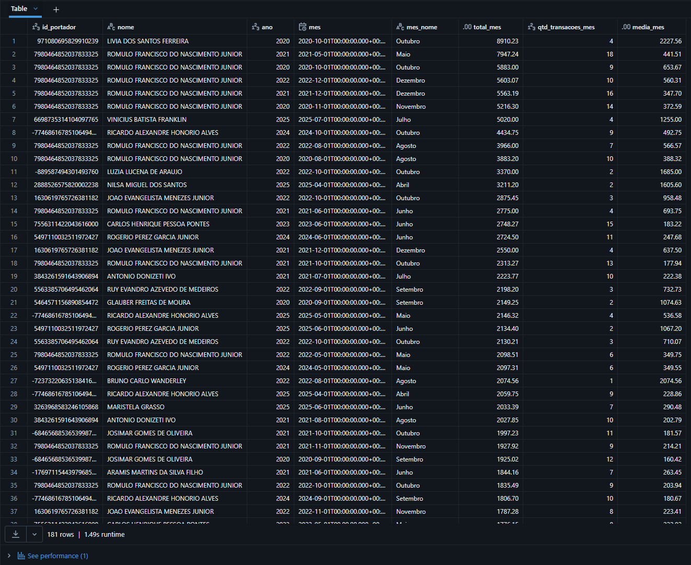

🟡 **Gold Estabelecimentos**

  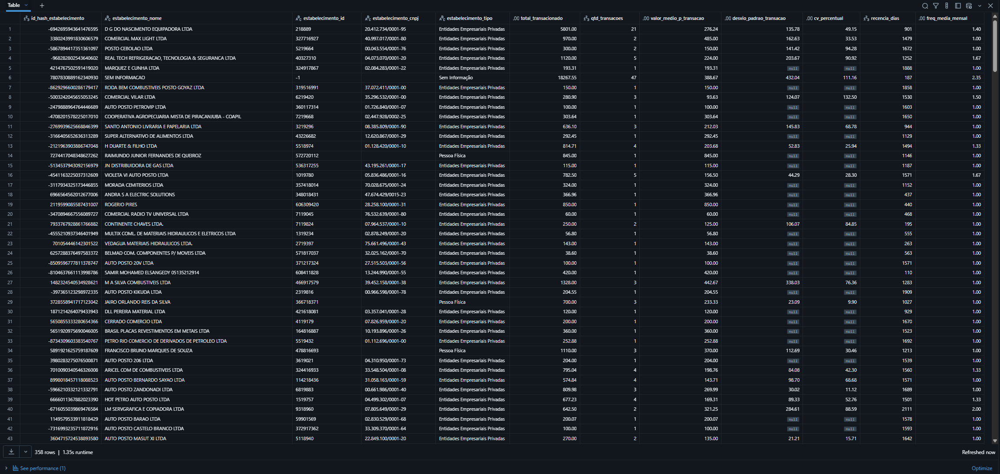

  

---

## Catalogo

  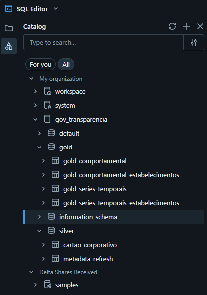

